<p align="center">
  
</p>

<p align="center">
  <a href="https://git.io/typing-svg">
    
  </a>
</p>

<p align="center">
  
  
  
</p>

<p align="center">
  <a href="https://naimur-reza.vercel.app" target="_blank">
    
  </a>
  <a href="https://linkedin.com/in/naimur-reza" target="_blank">
    
  </a>
  <a href="https://twitter.com/NaimurReza3" target="_blank">
    
  </a>
  <a href="mailto:naimur.rezaa@gmail.com">
    
  </a>
  <a href="https://www.facebook.com/iamrezadadu" target="_blank">
    
  </a>
</p>

---

## ⚡ Who am I?


```ts
const naimur = {
  title: "Frontend Software Engineer",
  basedIn: "Bangladesh 🇧🇩",
  mainStack: ["Next.js", "React", "TypeScript", "Node.js", "Express", "MongoDB"],
  alsoWorksWith: ["PostgreSQL", "Prisma", "AWS S3", "Vercel", "Cloudinary"],
  uiTools: ["Tailwind CSS", "ShadCN UI", "Redux Toolkit", "Figma"],
  currentlyLearning: ["Testing", "Redis", "Networking", "CI/CD", "Docker", "AWS"],
  builderMode: "dashboards, CMS, APIs, and full-stack products",
  mindset: "learn → build → ship → improve",
};
```

I build fast, clean, and scalable web apps with a strong focus on frontend architecture and real product experience. Most of my work revolves around Next.js, React, TypeScript, dashboards, CMS features, APIs, and performance-focused UI.

I enjoy turning complex requirements into smooth user experiences. Not just pushing pixels. Not just CRUD. Real product energy.

---

## 🧠 Current Mode

<table>
  <tr>
    <td width="33%" align="center">
      <h3>Frontend Craft</h3>
      <p>Modern UI, responsive layouts, component systems, smooth UX.</p>
    </td>
    <td width="33%" align="center">
      <h3>Full-Stack Growth</h3>
      <p>REST APIs, auth flows, database modeling, and scalable app structure.</p>
    </td>
    <td width="33%" align="center">
      <h3>DevOps Path</h3>
      <p>Docker, AWS basics, CI/CD, deployment, and production mindset.</p>
    </td>
  </tr>
</table>

---

## 🛠️ Tech Arsenal

<p align="center">
  
</p>

<table>
  <tr>
    <td><b>Frontend</b></td>
    <td>React, Next.js, TypeScript, Tailwind CSS, ShadCN UI, Redux Toolkit</td>
  </tr>
  <tr>
    <td><b>Backend</b></td>
    <td>Node.js, Express.js, REST API, MongoDB, PostgreSQL, Prisma</td>
  </tr>
  <tr>
    <td><b>Cloud / Tools</b></td>
    <td>AWS S3, Docker, Git, GitHub, Vercel, Netlify, Firebase, Appwrite, Cloudinary</td>
  </tr>
  <tr>
    <td><b>Leveling Up</b></td>
    <td>Testing, Redis, CI/CD, Basic Networking, DevOps fundamentals, AWS</td>
  </tr>
</table>

---

## 📊 GitHub Pulse

<p align="center">
  
</p>

<p align="center">
  <b>Consistency is the quiet proof that I am still building, learning, and getting better.</b>
</p>

---

## 🎯 2026 Focus

```txt
> Build stronger backend fundamentals
> Learn Redis, networking, testing, and CI/CD properly
> Think more in systems, architecture, and production reliability
> Contribute to useful open-source projects
> Become a better software engineer, not just a framework user
```

---

## 🤝 Connect With Me

<p align="center">
  <a href="https://linkedin.com/in/naimur-reza" target="_blank">
    
  </a>
  <a href="https://www.facebook.com/iamrezadadu" target="_blank">
    
  </a>
  <a href="https://twitter.com/NaimurReza3" target="_blank">
    
  </a>
</p>

<p align="center">
  <b>Thanks for visiting. Now go ship something cool 🚀</b>
</p>

<p align="center">
  
</p>
